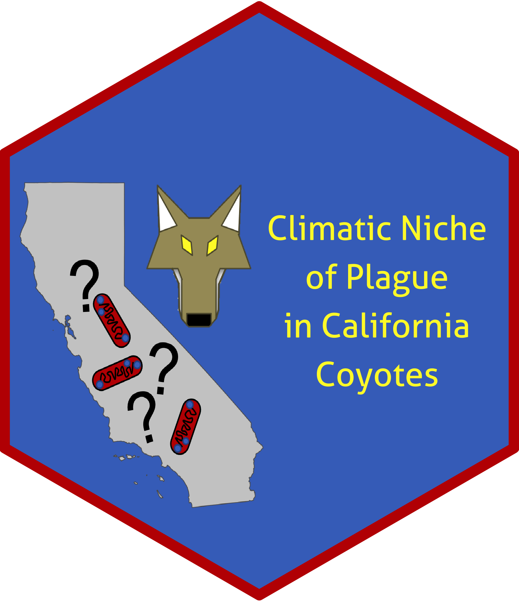

# Multiple "spaces": using wildlife surveillance, climatic variables, and spatial statistics to identify and map a climatic niche for endemic plague in California, U.S.A.
===

**Date repository last updated**: 2024-11-05

### Authors

* **Ian D. Buller**1 - *Corresponding Author* - [ORCID](https://orcid.org/0000-0001-9477-8582)
* **Gregory M. Hacker**2 - [ORCID](https://orcid.org/0000-0001-8925-643X)
* **Mark G. Novak**2
* **James R. Tucker**2
* **A. Townsend Peterson**3 - [ORCID](https://orcid.org/0000-0003-0243-2379)
* **Lance A. Waller**4 - *Senior Author* - [ORCID](https://orcid.org/0000-0001-5002-8886)

1.	Environmental Health Sciences, James T. Laney School of Graduate Studies, Emory University, Atlanta, GA, 30322, USA
2.  California Department of Public Health – Vector-Borne Disease Section, Sacramento, CA, 95814, USA
3.  Biodiversity Institute, University of Kansas, Lawrence, KS, 66045, USA
4.  Biostatistics and Bioinformatics, Rollins School of Public Health, Emory University, Atlanta, GA, 30322, USA

### Project Details

We combine two analytic concepts (ecological niche modeling and spatial point processes) to identify plague-suitable climates and map their locations within California. Our approach uses serological samples from coyotes (*Canis latrans*), a sentinel species for plague, a zoonotic disease caused by the gram-negative bacterium, *Yersinia pestis*. The approach accounts for spatially heterogeneous sampling effort by considering locations of both seropositive (case) and seronegative (control) coyotes. Modification of Chapter 3 from Ian Buller's Doctoral Dissertation from Emory University (see [Emory Theses and Dissertations Repository](https://etd.library.emory.edu/concern/etds/kh04dq776?locale=en)).

#### Project Timeframe

<table>
<colgroup>
<col width='20%' />
<col width='80%' />
</colgroup>
<thead>
<tr class='header'>
<th>Time</th>
<th>Event</th>
</tr>
</thead>
<tbody>
<tr>
<td>
1981-2010
</td>
<td>The <a href='http://prism.oregonstate.edu/'>Oregon State University Parameter-elevation Regression on Independent Slopes Model</a> (PRISM) 30-year average climate normals at a 2.5 arcminute (~16 km2) resolution (see data availability section below).</td>
</tr>
<tr>
<td>
1983-2015
</td>
<td>The <a href='https://www.cdph.ca.gov/Programs/CID/DCDC/Pages/VBDS.aspx'>California Department of Public Health – Vector-Borne Disease Section</a> (CDPH-VBDS) digitized coyote blood samples tested for <i>Y. pestis</i> antibodies (see data availability section below).</td>
</tr>
<tr>
<td>
October 2016
</td>
<td>Project Initiation</td>
</tr>
<tr>
<td>
December 2020
</td>
<td>The <a href='https://cran.r-project.org/package=envi'><i>envi</i></a> package in R published in the <a href='https://cran.r-project.org'>Comprehensive R Archive Network</a></td>
</tr>
<tr>
<td>
November 2023
</td>
<td>Initial manuscript submission to <a href='https://www.sciencedirect.com/journal/spatial-and-spatio-temporal-epidemiology'><i>Spatial and Spatio-temporal Epidemiology</i></a> for peer-review</td>
</tr>
<tr>
<td>
October 2024
</td>
<td>Manuscript accepted by <a href='https://www.sciencedirect.com/journal/spatial-and-spatio-temporal-epidemiology'><i>Spatial and Spatio-temporal Epidemiology</i></a></td>
</tr>
<tr>
<td>
November 2024
</td>
<td><a href='https://doi.org/10.1016/j.sste.2024.100696'>Manuscript published</a> in <a href='https://www.sciencedirect.com/journal/spatial-and-spatio-temporal-epidemiology'><i>Spatial and Spatio-temporal Epidemiology</i></a></td>
</tr>
</tbody>
</table>

### R Scripts Included In This Repository

This repository includes [R](https://cran.r-project.org) scripts used to calculate a spatial relative risk function in  'covariate space' and render the figures found in the following peer-reviewed manuscript:

Buller ID, Hacker GM, Novak MG, Tucker JR, Peterson AT, Waller LA. (2024) Multiple "spaces": using wildlife surveillance, climatic variables, and spatial statistics to identify and map a climatic niche for endemic plague in California, U.S.A. *Spatial and Spatio-temporal Epidemiology*, 51:100696 DOI: [10.1016/j.sste.2024.100696](https://doi.org/10.1016/j.sste.2024.100696) PMID: XXXXXX

<table>
<colgroup>
<col width='40%' />
<col width='60%' />
</colgroup>
<thead>
<tr class='header'>
<th>R Script</th>
<th>Description</th>
</tr>
</thead>
<tbody>
<td>
<a href='code/Paths.R'><code>Paths.R</code></a>
</td>
<td>Example paths for data. Must modify for your own system before beginning.</td>
</tr>
<tr>
<td>
<a href='code/Preparation.R'><code>Preparation.R</code></a>
</td>
<td>Load settings, prepare data, run the log RR model, and process the results to generate the figures.</td>
</tr>
<tr>
<td>
<a href='code/Figure1.R'><code>Figure1.R</code></a>
</td>
<td>Generate Figure 1</td>
</tr>
<tr>
<td>
<a href='code/Figure2.R'><code>Figure2.R</code></a>
</td>
<td>Generate Figure 2</td>
</tr>
<tr>
<td>
<a href='code/Figure3.R'><code>Figure3.R</code></a>
</td>
<td>Generate Figure 3</td>
</tr>
<tr>
<td>
<a href='code/Supplemental1.R'><code>Supplemental1.R</code></a>
</td>
<td>Generate Supplemental Figure 1</td>
</tr>
<tr>
<td>
<a href='code/Supplemental2.R'><code>Supplemental2.R</code></a>
</td>
<td>Generate Supplemental Figure 2</td>
</tr>
<tr>
<td></td>
<td>Supplemental Figure 3 hand-generated, no code used</td>
</tr>
<tr>
<td>
<a href='code/Supplemental4.R'><code>Supplemental4.R</code></a>
</td>
<td>Generate Supplemental Figure 4</td>
</tr>
<tr>
<td></td>
<td>Supplemental Figure 5 hand-generated, no code used</td>
</tr>
<td>
<a href='code/Supplemental6.R'><code>Supplemental6.R</code></a>
</td>
<td>Generate Supplemental Figure 6</td>
</tr>
<tr>
<td>
<a href='code/Supplemental7.R'><code>Supplemental7.R</code></a>
</td>
<td>Generate Supplemental Figure 7</td>
</tr>
<tr>
<td>
<a href='code/Supplemental8.R'><code>Supplemental8.R</code></a>
</td>
<td>Generate Supplemental Figure 8</td>
</tr>
</tbody>
</table>

The repository also includes the code and resources to create the project hexagon sticker.

### Getting Started

* Step 1: You must download the elevation BIL file at 4-km resolution from the [PRISM data portal](https://www.prism.oregonstate.edu/normals/)
* Step 2: Save the BIL file to the ['data'](data) directory in this repository
* Step 3: Set your own file paths to the data in the ['Paths.R'](code/Paths.R) file

### Data Availability

Wildlife plague surveillance data from the [California Department of Public Health – Vector-Borne Disease Section](https://www.cdph.ca.gov/Programs/CID/DCDC/Pages/VBDS.aspx) (CDPH-VBDS) available upon request to CDPH-VBDS [Infectious Diseases Branch - Surveillance and Statistics Section](https://www.cdph.ca.gov/Programs/CID/DCDC/Pages/SSS.aspx). The Oregon State University Parameter-elevation Regression on Independent Slopes Model (PRISM) 30-year average climate normals are available through the [*prism*](https://cran.r-project.org/package=prism) package in [R](https://cran.r-project.org) or directly from the [PRISM data portal](http://prism.oregonstate.edu/).

### Questions?

For questions about the manuscript please e-mail the corresponding author [Dr. Ian D. Buller](mailto:ian.buller@alumni.emory.edu).
